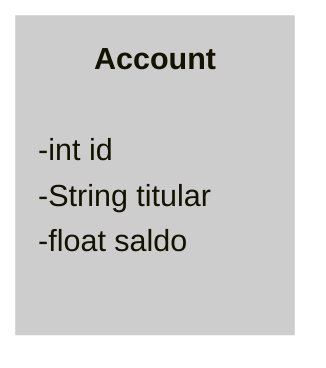

# Cases | CAST 2024
 


## CASE 2


#### Requisitos não funcionais

1- Criar operações de manipulação de contas:

* Criar conta.
* Creditar valor em uma conta.
* Debitar valor de uma conta.
* Transferir valor entre contas.

2- Validar as operações (ex.: não permitir transferências ou débitos que
deixem a conta com saldo negativo).


### Modelo
O modelo utilizado para armazenar e gerenciar as contas é o seguinte:



### Testes

A seguir, apresentamos os endpoints utilizados para a realização dos testes: 


observação | REST | url |
-|-|-
crear conta | POST | http://localhost:8091/contas?titular=cast-case
consultar conta | GET | http://localhost:8091/contas/1
creditar | POST | http://localhost:8091/contas/1/creditar

> Body (form-data): <br>
> valor: 100.22

observação | REST | url |
-|-|-
debitar | POST | POST http://localhost:8091/contas/1/debitar

> Body (form-data): <br>
> valor: 50.10

### Visualização do Console H2

Para acessar o console H2 no navegador, siga as instruções abaixo:

link [h2-console][link-h2]
* JDBC URL : jdbc:h2:mem:contacastdb
* User : admin
* pass : 1234


---

## CASE 3

Considero que o acesso a uma mesma conta, durante o uso do sistema, pode resultar em diversas operações que tentam atualizar o saldo simultaneamente. 
Para evitar essa situação, recomenda-se implementar um bloqueio de acesso aos registros enquanto a conta estiver em uso. Essa medida garantirá a integridade dos dados e a precisão das operações realizadas.


> -- iniciando uma transferencia <br>
> INFO: **Starting transfer from account 1001 to account 1002 with amount 500.0** <br>
> ERROR: Insufficient funds in account: 1001 <br>
> INFO: Rolling back transaction due to error <br>
> -- iniciando uma outra transferencia <br>
> INFO: **Starting transfer from account 1003 to account 1004 with amount 100.0** <br>
> ERROR: Could not execute statement; SQL [n/a]; constraint [null]; nested exception is **org.hibernate.exception.ConstraintViolationException**: could not execute statement

```java
    @Lock(LockModeType.PESSIMISTIC_WRITE)
    Optional<Conta> findByIdWithLock(Long id);
```


<!-- links and tools -->
[link-h2]:http://localhost:8091/h2-console
